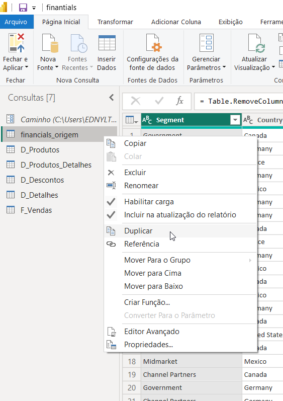
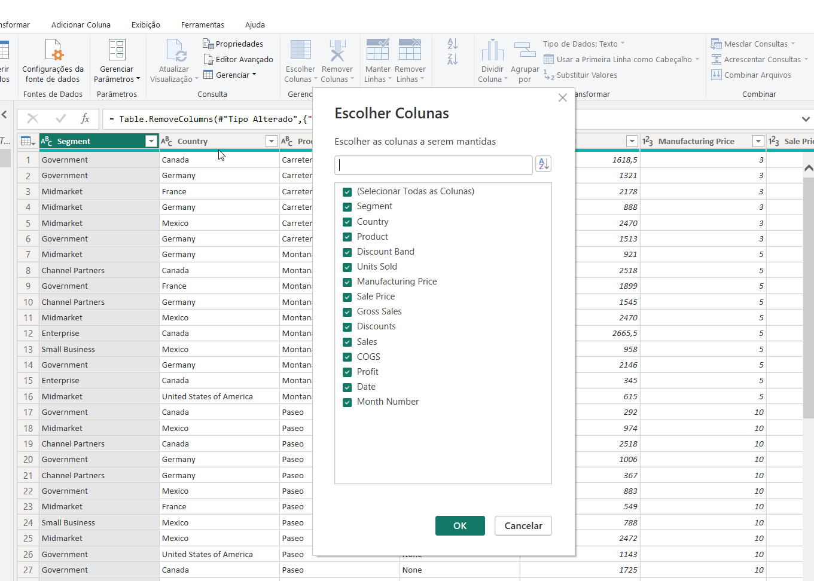
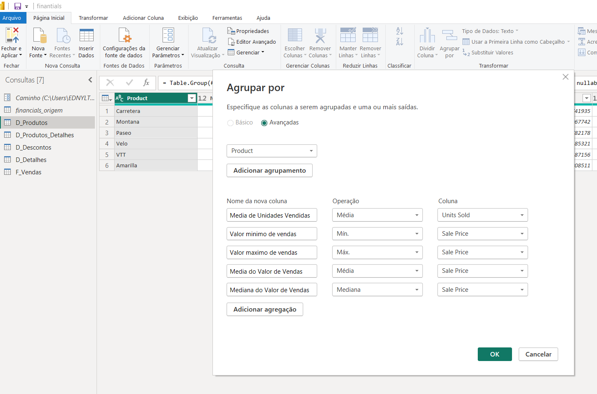
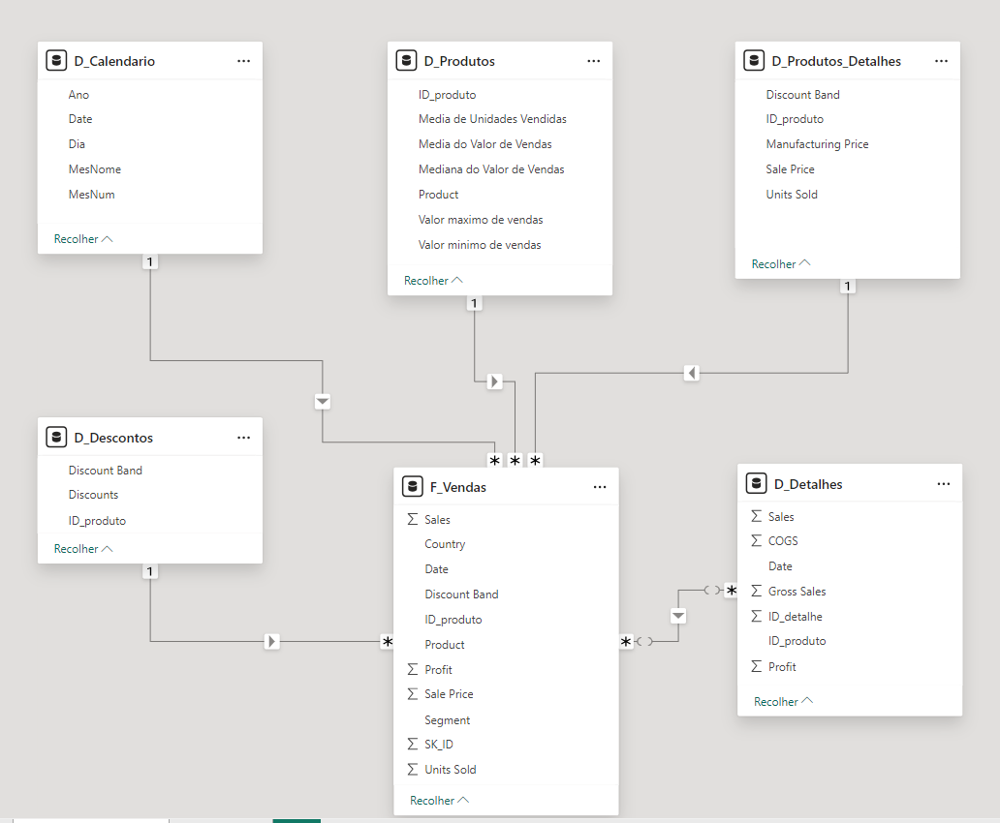
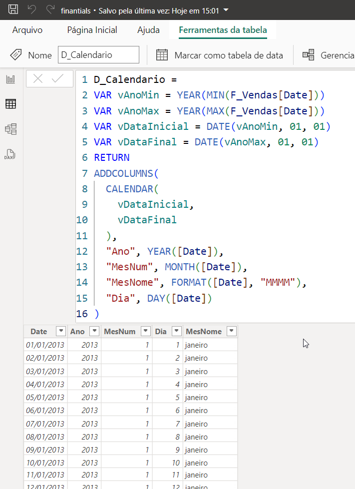

# Modelando um Dashboard de E-commerce com Power BI Utilizando Fórmulas DAX

Este repositório é a solução do desafio proposto no bootcamp NTT DATA - Engenharia de Dados com Python da DIO.

**Desafio:**

> Utilizaremos a tabela finantials-origem para criar as tabelas dimensão e fato do nosso modelo baseado em star schema.
>
> O processo consiste na criação das tabelas com base na tabela original. A partir da cópia serão selecionadas as colunas que irão compor a visão da nova > > tabela. Sendo assim, a partir da tabela principal serão criadas as tabelas:
>
>     Financials_origem (modo oculto – backup)
>
>     D_Produtos (ID_produto, Produto, Média de Unidades Vendidas, Médias do valor de vendas,
>                 Mediana do valor de vendas, Valor máximo de Venda, Valor mínimo >   de Venda)
>  
>     D_Produtos_Detalhes(ID_produtos, Discount Band, Sale Price, Units Sold, Manufactoring Price)
>
>     D_Descontos (ID_produto, Discount, Discount Band)
>
>     D_Detalhes (*)
>
>     D_Calendário – Criada por DAX com calendar()
>
>     F_Vendas (SK_ID , ID_Produto, Produto, Units Sold, Sales Price, Discount Band, Segment, Country,
>               Salers, Profit, Date (campos))
> 
>
>     *Verifique as informações que não foram contempladas nas demais tabelas dimensão que fornecem
>      maiores detalhes sobre vendas.

**Sumário**:

- [A tabela finantials-origem](#a-tabela-finantials-origem)
- [O ETL dimensional: dimensões e fatos](#o-etl-dimensional-dimensões-e-fatos)
- [O modelo dimensional star schema](#o-modelo-dimensional-star-schema)
- [A tabela Calendario com DAX](#a-tabela-calendario-com-dax)

### A tabela <code>finantials-origem</code>

Inicialmente, a tabela <code>finantials_origem</code> continha **todas as colunas do modelo**, como mostra a figura abaixo.

### O ETL dimensional: dimensões e fatos

Agora precisamos separar a tabela <code>finantials_origem</code> nas suas dimensões e fatos, como mostra o passo-a-passo:

1. Duplicar a tabela finantials-origem

- 

2. Escolher somente as colunas correspondentes

- 

3. Adicionar novas colunas se necessario  

- 

### O modelo dimensional star schema

Por fim, conforme a modelagem dimensional, temos o modelo dividido em fatos e dimensões, onde as dimensões se ligam às fatos e permitem o cruzamento dos dados:

### A tabela Calendario com DAX

A tabela calendario foi feita com DAX (*Data Analysis Expressions*), utilizando a função <code>CALENDAR()</code>:

