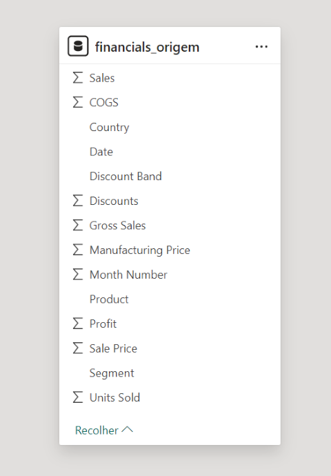
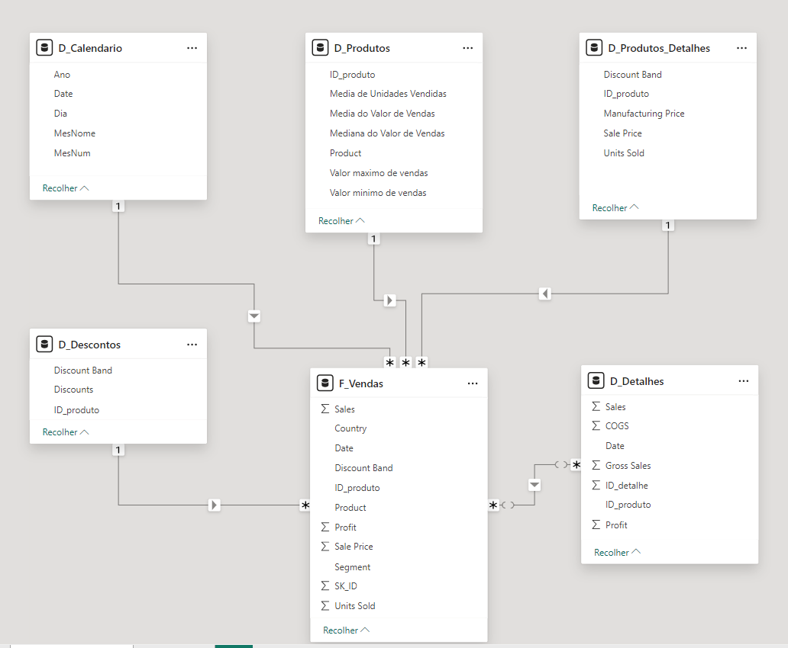

# Modelando um Dashboard de E-commerce com Power BI Utilizando Fórmulas DAX

Desafio:

Inicialmente, a tabela <code>finantials_origem</code> continha todas as colunas do modelo, como mostra a figura abaixo.

Agora, conforme a modelagem dimensional, temos o modelo dividido em fatos e dimensões:

